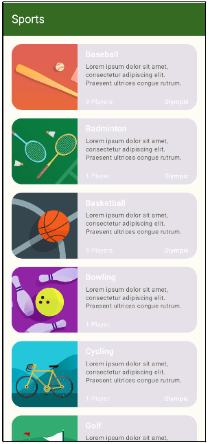
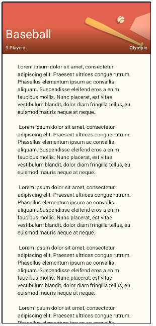

# 🏅 **Sports**
**Sports** is a modern Android application that lets you view and explore a list of sports, with specific details for each sport. It is developed with Jetpack Compose and follows development best practices, including MVVM architecture.

## 📋 **Features**
   - 📂 **Sports list**:
      - Browse a list of sports.
      - Each item displays an image, a title, a subtitle, and specific information such as the number of players or whether the sport is Olympic.
   - 🔍 **Sport details**:
      - View detailed information on a selected sport, such as a banner, description and additional information.
   - 🎨 **Modern, fluid interface**:
      - Use of Jetpack Compose for a declarative user interface.
      - Integration of Material 3 for a modern, accessible design.
      - Support for light and dark themes

## 🛠️ **Tech Stack**
   - **Kotlin**: Modern, concise language for Android development.
   - **Jetpack Compose**: Declarative UI toolkit for Android.
   - **Material 3**: Modern, accessible user interface.
   - **StateFlow**: Reactive state management for real-time updates.
   - **ViewModel**: MVVM architecture to separate business logic from user interface.

## 📦 **Project Structure**
**Packages**:
1. **Data**:
   - Defines data models for sports:
      - **Sport**: Template representing a sport with fields such as name, number of players, and whether the sport is Olympic.
2. **data.local**:
   - Provides simulated static data:
      - **LocalSportsDataProvider**: Contains fictitious datas about sports.
3. **Ui**:
   - Implements the user interface using Jetpack Compose:
      - **SportsApp**: application's main entry point.
      - **SportsList**: Display sports list.
      - **SportsDetail**: Displays the details of a selected sport.
4. **Viewmodel**:
   - Manages reactive states with StateFlow:
      - **SportsViewModel**: Manages navigation between list and details, as well as updating of displayed data.

## 🚀 **How to Use**
1. **Launch the App**:
   - Open the app on a Android device or emulator.
2. **Navigate the sports list:**:
   - Browse the different sports in the list.
3. **View sport details**:
   - Tap on a sport to see its details.
4. **Navigate between screens**:
   - Use the top bar to return to the list or explore details.

## 📸 **Screenshots**
- **Sports app main screen**:

   

- **Sport details screen**:

   

## 🤝 **Contributions**
Contributions are welcome! Feel free to fork the repository and submit a pull request for new features or bug fixes.